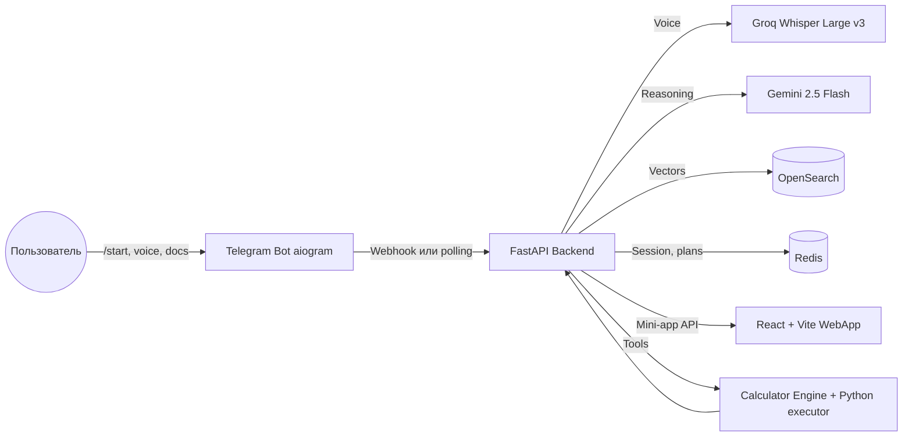
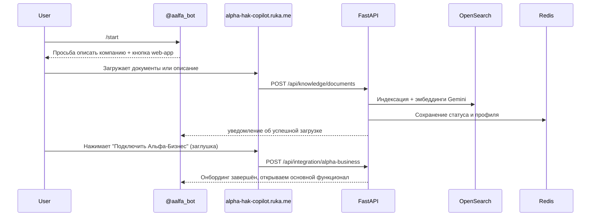

# Alfa HAK Copilot — автономный AI-калькулятор для Альфа-Бизнеса

         

> Единое AI-ядро, которое получает операции из Альфа-Бизнеса, прогоняет их через риск-менеджмент, знания компании и умный калькулятор. Система уже развёрнута на сервере, работает 24/7 и отвечает пользователям через Telegram-бота и мини-веб-приложение.


## Быстрые ссылки
- Telegram-бот: [`@aalfa_bot`](https://t.me/aalfa_bot)
- Встроенный web-app: [`alpha-hak-copilot.ruka.me`](https://alpha-hak-copilot.ruka.me) (`t.me/aalfa_bot?startapp`)
- Продакшен API: [`https://api-alpha-hak-copilot.ruka.me`](https://api-alpha-hak-copilot.ruka.me)
- Swagger UI (live): [`https://api-alpha-hak-copilot.ruka.me/api/docs`](https://api-alpha-hak-copilot.ruka.me/api/docs)
- Оффлайн OpenAPI-спека: `Backend/docs/openapi.yaml`

## Что делает система
- Принимает текст, документы и голосовые сообщения, индексирует и обогащает знаниями компании (OpenSearch + Redis).
- ИИ на базе Gemini решает, отвечает ли сам как советник или запускает калькулятор с точными вычислениями и исполнением кода.
- Умный калькулятор прогнозирует расходы и кэшфлоу бизнеса, учитывая операции Альфа-Бизнеса и замечания клиента.
- Веб-приложение отображает память ИИ: сколько документов загружено, история чатов, дашборды и комментарии.
- Бэкенд и бот уже живут в проде, поэтому все команды отрабатывают сразу без ручного старта служб.

## Архитектура и агенты



**User agents (по порядку):**
1. **Onboarding Agent** – спрашивает в Telegram `/start`, просит описать компанию или загрузить документы, ведёт в web-app.
2. **Knowledge Agent** – режет документы, пишет эмбеддинги, поднимает векторные поисковые хиты в OpenSearch.
3. **Advisor Agent** – когда вопрос не про расчёт, отвечает сразу, используя накопленный контекст.
4. **Calculator Agent** – формирует план с переменными и формулами, просит подтверждение и выполняет код через `python_code_executor`.
5. **Memory Agent** – сохраняет чат и замечания пользователя, чтобы в следующих расчётах избегать ошибок.

## User story (первый вход)


## User story (рабочий режим)
1. Пользователь пишет текстом или голосом. Голос идёт в Groq `whisper-large-v3-turbo`, текст транскрибируется и сразу обрабатывается.
2. Оркестратор строит сессию: собирает последние сообщения, профиль компании, свежие документы из OpenSearch.
3. Gemini решает: ответить как советник или запустить калькуляцию. Для расчётов строится JSON-план (переменные, формулы, код) и отправляется на подтверждение пользователю.
4. После подтверждения `CalculatorEngine` запускает код в песочнице, может несколько раз запросить доп. данные, вернуть результат и риск-комментарии.
5. Ответ + контекст сохраняются в OpenSearch, чтобы AI учитывал прошлые расчёты и замечания.

## Технологический стек и микросервисы

| Слой | Технологии |
| --- | --- |
| Бот | Telegram Bot API + aiogram 3.x, кнопки для mini-app и интеграций |
| Backend | FastAPI + uvicorn, роутеры `chat`, `documents`, `integration`, `health` |
| AI | Gemini 2.5 Flash (reasoning/decision), Gemini Embeddings, Groq Whisper Large v3 Turbo (speech→text) |
| Память | OpenSearch (индексы `alfa-pilot-knowledge`, `alfa-pilot-dialogs`), Redis (сессии, планы, профили) |
| Калькуляторы | `CalculatorEngine` + `python_code_executor`, риск-модуль и прогноз расходов на операциях Альфа-Бизнеса |
| Frontend | React 18 + Vite, Telegram Web App (TWA), Tailwind-friendly UI |
| Delivery | Docker (два образа: `alfa-pilot-backend`, `alfa-pilot-frontend`), systemd/cron на сервере |

## Swagger / API документация
- Автогенерируемый UI: `https://api-alpha-hak-copilot.ruka.me/api/docs` (FastAPI + Swagger UI).
- Офлайн спецификация: `Backend/docs/openapi.yaml` (Swagger 3.0) – включает health, knowledge, chat, calculator execution и onboarding-интеграции.
- Для локальной разработки: `http://localhost:8000/api/docs` (после запуска backend) или `uvicorn app.main:app --reload`.

## Мини-приложение (TWA)
- Отображает все загруженные документы, папки, индексы, комментарии и подсказки ИИ.
- Показывает в реальном времени, сколько знаний уже в памяти, где были ошибки калькулятора, какой шаг онбординга.
- Встроенная кнопка «Запустить расчёт» и просмотр json-планов.

## Возможности backoffice
- **Документы**: поддержка PDF/Markdown/JSON/Plain-text, автоматическая нарезка chunk'ов и построение эмбеддингов.
- **Расчёты**: прогноз расходов и сценарный анализ кэшфлоу — можно попросить «посчитай зарплатный фонд на квартал» или «оценка рисков по операционным затратам».
- **Голосовой ввод**: Groq API (`https://api.groq.com/openai/v1/audio/transcriptions`) доступен сразу. Пример:
```python
from groq import Groq

client = Groq()
with open("voice.wav", "rb") as file:
		transcription = client.audio.transcriptions.create(
				file=file,
				model="whisper-large-v3-turbo",
				response_format="verbose_json",
				temperature=0.0,
		)
		print(transcription.text)
```
- **Память о замечаниях**: все претензии пользователя записываются и подмешиваются в будущие расчёты через Redis + OpenSearch.
- **Интеграция с Альфа-Бизнес**: сейчас заглушка (web-app сообщает об успешной связи), но API уже принимает подтверждение и держит статус в Redis.

## Запуск и деплой

### Production-ready Docker (без compose)
```bash
# Backend
cd Backend
docker build -t alfa-pilot-backend .
docker run -d \
	--name alfa-pilot-backend \
	--env-file .env \
	-p 8000:8000 \
	alfa-pilot-backend

# Frontend
cd Frontend
docker build -t alfa-pilot-frontend .
docker run -d \
	--name alfa-pilot-frontend \
	-p 8080:80 \
	-e VITE_API_BASE_URL="https://api-alpha-hak-copilot.ruka.me/api" \
	alfa-pilot-frontend

# Redis (если нужен локально)
docker run -d --name redis -p 6379:6379 redis:7-alpine

# OpenSearch (single-node demo)
docker run -d --name opensearch -p 9200:9200 -e discovery.type=single-node -e "DISABLE_SECURITY_PLUGIN=true" opensearchproject/opensearch:2.13.0
```

### Локальная разработка
```bash
# Backend
cd Backend
python -m venv .venv
.venv\Scripts\activate
pip install -r requirements.txt
uvicorn app.main:app --reload

# Frontend
cd Frontend
npm install
npm run dev
```

### Переменные окружения (Backend/.env)

| Ключ | Назначение |
| --- | --- |
| `BOT_TOKEN` | токен @aalfa_bot |
| `TWA_URL` | `https://alpha-hak-copilot.ruka.me` |
| `API_KEY_AI_MODEL` / `LLM_MODEL_NAME` | ключ и модель Gemini 2.5 |
| `API_KEY_SPEECH2TEXT`, `API_URL_SPEECH2TEXT` | доступ к Groq whisper-large-v3 |
| `REDIS_URL` | URL запущенного Redis (уже развёрнут) |
| `OPENSEARCH_URL` | URL OpenSearch (нужно лишь запустить сервис) |
| `WEBHOOK_BASE_URL`, `WEBHOOK_SECRET_TOKEN` | боевой webhook Telegram |

## Наблюдаемость и эксплуатация
- Structured logging (`Backend/app/utils/logging.py`) → легко стримить в Loki/ELK.
- Health-check: `GET /api/health` (показывает среду деплоя).
- Автоматический фоллбек: если вебхук недоступен, бот переходит в long polling и остаётся онлайн.
- Все индексы и планы имеют TTL в Redis, поэтому кеш не разрастается бесконечно.

## Roadmap / next steps
- Подключить реальную интеграцию с Альфа-Бизнес API вместо заглушки.
- Добавить новые калькуляторные инструменты (SQL, python notebooks, внешние API).
- Расширить web-app: визуализация загрузок, графики рисков, управление папками.
- Настроить backup OpenSearch + аналитические дешборды (Grafana/Redash).